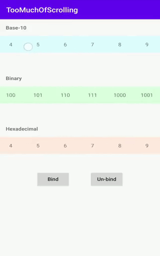

# README #

## Presentation ##

This is the source code of the Android application: `-=:[ TooMuchOfScrollingAndroid ]:=-`

This is a driver application to show the result of using the method `RecyclerView.bindScrollTo(vararg destinations: RecyclerView): RecyclerView.OnScrollListener` defined inside `RecyclerViewExtension.kt`.

- - -

# Explore! #

Feel free to checkout and launch the app 🎡

To find out more, read the related article:

[**Android: RecyclerView, how to let many of them scroll altogether**](https://medium.com/@lukelorusso/android-recyclerview-how-to-let-many-of-them-scroll-altogether-383700aeadc1)

- - -

# Copyright #

Make with 💚 by [Luca Lorusso](https://lukelorusso.com), licensed under [Apache License 2.0](https://www.apache.org/licenses/LICENSE-2.0)
